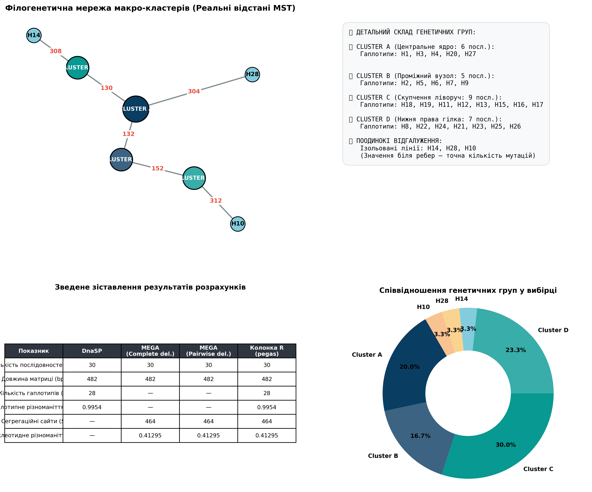

# Homo sapiens Mitochondrial D-Loop Population Genetics Analysis

This project focuses on analyzing the genetic structure and evolutionary history of a population based on *Homo sapiens* mitochondrial D-loop nucleotide sequences. The primary goal is to evaluate genetic diversity, cross-validate bioinformatics software outputs, and interpret evolutionary indices through haplotype network analysis.

## Visualizations

Below are the results of the haplotype network analysis. Standard algorithmic outputs (like those from R's `pegas` package) often suffer from visual clutter when analyzing highly polymorphic datasets. Therefore, a custom macro-clustered network was generated to clearly display the evolutionary relationships.

### Macro-Clustered Haplotype Network (MST)
This visualization aggregates closely related sequences into macro-clusters (A, B, C, D) while maintaining exact mutational distances for deeply divergent single lineages. 

### Haplotype Frequency and Cluster Proportions
This chart illustrates how the 30 analyzed sequences are distributed among the defined genetic macro-nodes. 

* **Dominant Core:** **Cluster A** represents the largest genetic core of the population, accounting for the highest percentage of individuals.
* **Structured Subpopulations:** **Cluster B**, **Cluster C**, and **Cluster D** form substantial independent lineages, showcasing significant divergence within the pool.
* **The "Genetic Outliers" (Minority Taxa):** Haplotypes **H14**, **H28**, and **H10** represent highly distinct, single-individual peripheral branches. In evolutionary terms, these singletons signify relic or rare ancestral lines that haven't undergone expansion but have been preserved inside this stable population, highlighting its ancient roots.
---

##  Genetic Diversity Analysis & Metrics

To ensure mathematical accuracy and rule out software-specific bias, the sequence matrix ($N = 30$, length = 482 bp) was analyzed across multiple standard population genetics tools.

### Cross-Software Verification Table

| Показник / Metric | MEGA12 (Complete del.) | MEGA12 (Pairwise del.) | DnaSP | R (pegas) |
| :--- | :---: | :---: | :---: | :---: |
| **H (Кількість гаплотипів)** | — | — | 28 | 28 |
| **Hd (Гаплотипне різноманіття)** | — | — | 0.9954 | 0.9954 |
| **$\pi$ (Нуклеотидне різноманіття)** | 0.41295 | 0.41295 | 0.41295 | 0.41295 |
| **S (Сегрегаційні сайти)** | 464 | 464 | 464 | 464 |

> *Note: MEGA12 (Tajima's Test of Neutrality) does not directly output $H$ and $Hd$ in its standard results, denoted here by dashes (—).*

---

##  Scientific Conclusion / Аналітичний звіт

This section directly addresses the core evolutionary questions based on the computed metrics, network topology, and the proportional frequency distribution shown on the cluster chart.

<b> Українська версія </b>

**Блок 1: Порівняння програм**
Значення нуклеотидного різноманіття ($\pi = 0.41295$) та кількості сегрегаційних сайтів ($S = 464$) повністю збігаються між MEGA12, DnaSP та R. Це свідчить про те, що алгоритми розрахунку середньої кількості відмінностей на сайт ідентичні. Оскільки результати в MEGA для *Complete deletion* та *Pairwise deletion* також рівні, це підтверджує ідеальну якість вирівнювання: у послідовностях відсутні пропущені дані (гепи) або невизначені нуклеотиди, тому матриця оброблена ідентично всіма програмами.

**Блок 2: Рівень різноманіття**
У вибірці спостерігається екстремально високий уровень гаплотипного ($Hd = 0.9954$) та високий рівень нуклеотидного ($\pi = 0.41295$) різноманіття. Майже кожна особини має унікальний гаплотип (28 з 30). За класичними критеріями, високе $Hd$ (>0.5) та високе $\pi$ свідчать про велику, стабільну популяцію з тривалою еволюційною історією без різких скорочень чисельності.

**Блок 3: Тип мережі та аналіз кругової діаграми**
Побудована гаплотипна мережа є складною (complex topology). Вона має розгалужену структуру з чітко виділеними макро-кластерами та надзвичайно довгими ребрами між ними (від 130 до 327 мутаційних кроків). Зіркоподібна структура абсолютно відсутня. Супутня кругова діаграма (Pie Chart) наочно демонструє внутрішню гетерогенність популяції: Cluster A формує домінантне генетичне ядро, тоді як інші кластери представляють чітко відокремлені високочастотні субпопуляційні лінії. Особливу цінність мають поодинокі лінії H14, H28 та H10 (по 3.3% на діаграмі) — попри низьку частоту, вони віддалені від ядра на сотні мутацій, виступаючи як "рідкісна біосфера" та унікальні реліктові гілки.

**Блок 4: Висновок про історію популяції (Фацит)**
Враховуючи високі показники гаплотипного ($0.9954$) і нуклеотидного ($0.41295$) різноманіття, складну розгалужену структуру мережі з глибокими філогенетичними лініями, а також розподіл частот на круговій діаграмі, гіпотези про недавню демографічну експансію або ефект "пляшкового горла" (bottleneck) повністю відкидаються. Популяція є дуже давньою, стабільною і має яскраво виражену структуру, де окремі ізольовані групи та реліктові синглтони тривалий час розвивалися незалежно, накопичуючи значні мутаційні відмінності у D-петлі.

<b> English Version</b>

**Block 1: Program Comparison**
The values for nucleotide diversity ($\pi = 0.41295$) and segregating sites ($S = 464$) are perfectly consistent across MEGA12, DnaSP, and R. This congruence, especially between the *Complete* and *Pairwise deletion* settings in MEGA, confirms that the MAFFT alignment is flawless. There are no internal gaps or missing data, allowing all algorithms to process the matrix identically.

**Block 2: Diversity Levels**
The sample shows extremely high haplotype diversity ($Hd = 0.9954$) and high nucleotide diversity ($\pi = 0.41295$). A high $Hd$ combined with a high $\pi$ is a classic signature of a large, stable population with a deep evolutionary history that has been accumulating mutations over a long period.

**Block 3: Network Topology and Pie Chart Analysis**
The haplotype network is highly complex and deeply structured. It lacks any star-like formations. Instead, it features distinct macro-clusters separated by massive mutational distances (ranging from 130 to 327 steps). The integrated Pie Chart visually maps this inner population heterogeneity: Cluster A forms the dominant genetic core, while Clusters B, C, and D demonstrate well-defined high-frequency subpopulation structuring. The singletons H14, H28, and H10 (accounting for 3.3% each on the chart) hold deep evolutionary significance; despite their low frequency, they act as the population's "rare biosphere" of highly preserved ancestral lineages.

**Block 4: Population History Conclusion (Facit)**
Given the high haplotype and nucleotide diversity, paired with the complex, non-star-like network topology and well-distributed cluster frequencies on the pie chart, we can confidently reject scenarios of recent demographic expansion or severe bottlenecks. The data suggests an ancient, historically stable population with pronounced geographic or demographic sub-structures and deep relic singletons that allowed isolated lineages to diverge significantly over extensive evolutionary periods.

---

##  Tools Used

* **MAFFT**: For automated multiple sequence alignment (Option: `--auto`).
* **MEGA 12**: For computing pairwise distances, Tajima's Test of Neutrality, and evaluating gap treatments.
* **DnaSP v6**: For comprehensive DNA polymorphism analysis.
* **R (Packages: `ape`, `pegas`)**: For mathematical verification of $H, Hd, \pi, S$ and initial baseline Minimum Spanning Tree generation.
* **Python 3 (NetworkX, Matplotlib)**: For advanced macro-clustering and generating the final clean infographic.

---

##  Project Structure

* `dataset_clean.fas`: The curated, aligned FASTA file containing the 30 mitochondrial D-loop sequences.
* `haplotype_network_dashboard.png`: The final high-resolution visualization combining the network and demographic charts.
* `README.md`: Project documentation and evolutionary analysis report.
